# 📦 JF&I CONSOL - Desktop Stock Control System

> A premium, single-user Desktop Stock Controlling System custom-built for **JFI CONSOLIDATED (PVT) LTD**. This application streamlines warehouse operations, manages inventory levels, coordinates purchase orders, tracks goods received/issued, and provides rich analytical reports.

---
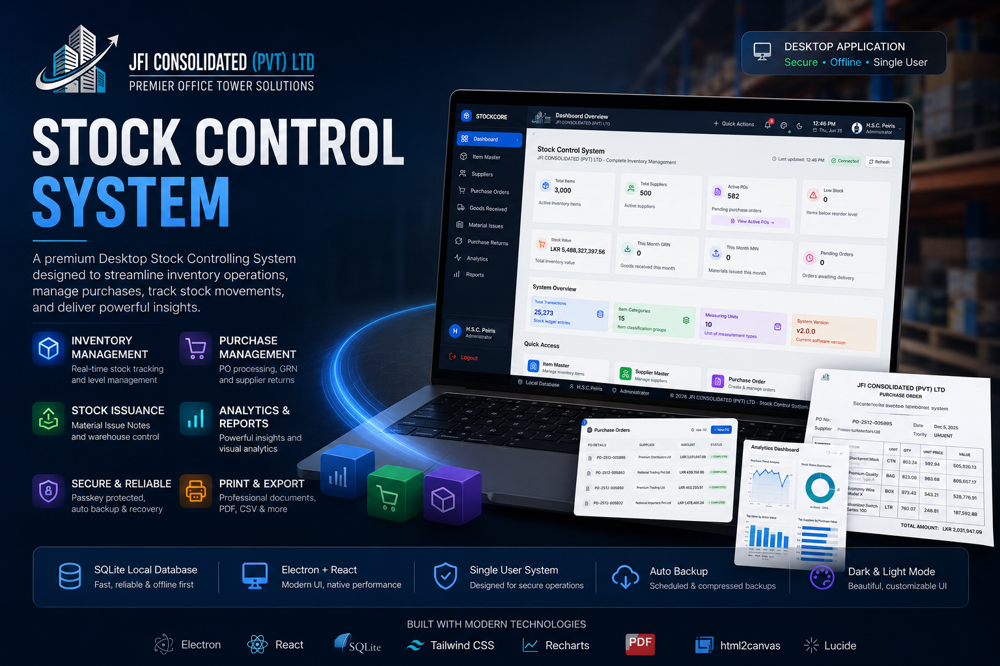
---

## 🚀 Key System Features

The system is fully modularized and contains the following core modules:

*   **📊 Interactive Dashboard**
    *   Real-time statistics displaying **Total Items**, **Active Suppliers**, **Pending Purchase Orders**, and **Low Stock Alerts**.
    *   Dynamic quick action buttons for faster navigation.
    *   Interactive chart showing recent transaction trends.
*   **📦 Item Master Management**
    *   Full CRUD operations on items, specifying item codes, descriptions, category, sub-category, specifications, part/lot numbers, unit of measure, and warehouse location.
    *   Configurable **Reorder Level**, **Reorder Quantity**, **Lead Time**, and **Monthly Requirement** thresholds.
    *   Automated stock-on-hand tracking linked directly with ledger updates.
*   **🤝 Supplier Master Management**
    *   Supplier profiles including SVAT/VAT details, SVAT tax file numbers, SvVAT/VAT status, telephone, fax, and email.
    *   Defined **Credit Limits** and **Default Discounts** per supplier.
*   **📝 Purchase Order (PO) Processing**
    *   Generate and manage Purchase Orders with standard or urgent priorities.
    *   Calculates real-time PO values, tax deductions, and total order amounts.
    *   Export POs with a clean, professional print layout (`POPrint`).
*   **📥 Goods Received Note (GRN)**
    *   Records goods arrival and matches items received against original POs.
    *   Updates Unit Prices and triggers automatic stock-on-hand updates in the database.
    *   Records payment terms (Credit, Cash, Cheque) and updates the transaction log.
*   **📤 Material Issue Note (MIN)**
    *   Controls and logs stock issuance from stores to specific machine sections.
    *   Checks stock levels in real time to prevent issuing above available quantities.
*   **↩️ Purchase Returns (PRN)**
    *   Manages returns of damaged or incorrect items back to suppliers.
    *   Automatically deducts returned quantities from the warehouse stock.
*   **📈 Reports & Analytics**
    *   Rich data grids presenting Item Registers, Supplier Ledger, Stock Balance reports, and Reorder reports.
    *   **Advanced Analytics dashboard** powered by interactive visual charts (`recharts`) tracking monthly stock trends, category distribution, and top suppliers.
*   **🔒 Security & Local Database Backups**
    *   Passkey-protected login for administrators.
    *   Automatic session timeout after 30 minutes of inactivity.
    *   Automated database backups (gzipped SQLite databases) with configurable retention days and intervals.

---

## ⚙️ System Architecture

The application relies on a modern, offline-first architecture combining **Electron** (for desktop execution and OS API access) with **React** and **SQLite3**.


---


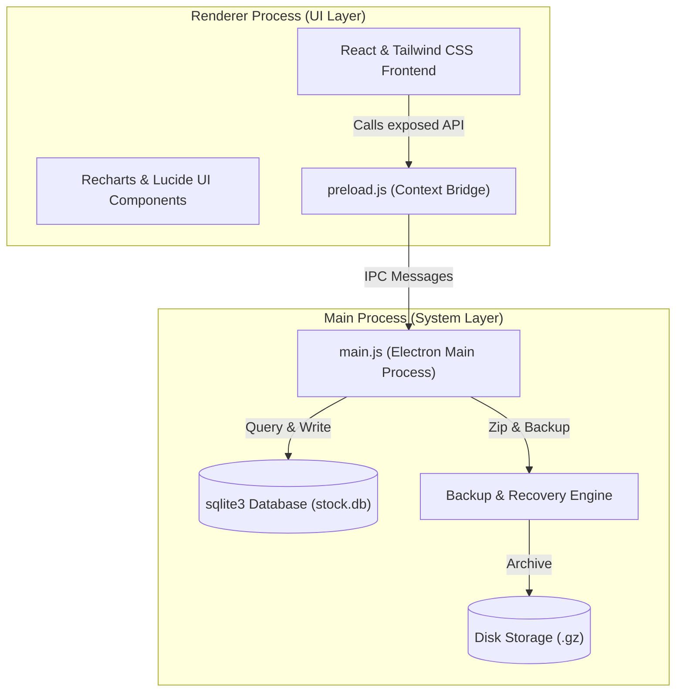
```mermaid
graph TD
    subgraph Renderer_Process ["Renderer Process (UI Layer)"]
        React["React & Tailwind CSS Frontend"]
        Recharts["Recharts & Lucide UI Components"]
        React -->|Calls exposed API| Preload["preload.js (Context Bridge)"]
    end

    subgraph Main_Process ["Main Process (System Layer)"]
        ElectronMain["main.js (Electron Main Process)"]
        SQLite3[("sqlite3 Database (stock.db)")]
        BackupEngine["Backup & Recovery Engine"]
        
        Preload -->|IPC Messages| ElectronMain
        ElectronMain -->|Query & Write| SQLite3
        ElectronMain -->|Zip & Backup| BackupEngine
        BackupEngine -->|Archive| Disk[("Disk Storage (.gz)")]
    end
```

---

## 📁 Codebase Directory Structure

```filepath
stock-control-system/
├── main.js                 # Electron Main entry point & IPC handlers
├── preload.js              # Electron Preload Context Bridge APIs
├── database.js             # SQLite3 schema, auto-backup & helper functions
├── package.json            # Scripts and dependencies configuration
├── public/                 # Static assets for React
├── assets/                 # App icons & branding logos
└── src/
    ├── App.jsx             # Root React component managing routes/theme
    ├── index.css           # Global CSS & Tailwind imports
    ├── components/
    │   ├── Dashboard.js    # Metric cards, statistics & shortcuts
    │   ├── ItemMaster.js   # Inventory creation and ledger review
    │   ├── SupplierMaster.js # Supplier setup & tax details
    │   ├── PurchaseOrder.js # Generate and review orders
    │   ├── GRN.js          # Inward stock notes matching
    │   ├── MIN.js          # Outward material allocation notes
    │   ├── PurchaseReturn.js # Manage returned orders
    │   ├── Reports.js      # Structured grids and exports (PDF/CSV)
    │   ├── Analytics.js    # Data visualization graphs
    │   ├── LoginPage.js    # Passkey authentication & UI personalization
    │   ├── UI/             # Shared layout components (Header, Sidebar, DataGrid, etc.)
    │   └── PrintTemplates/ # Print templates (POPrint, GRNPrint, MINPrint, PRNPrint)
    └── utils/              # Calculation helpers & formatting scripts
```

---

## 🛠️ Technology Stack

| Technology | Purpose |
| :--- | :--- |
| **Electron** | Desktop wrapper enabling native system access and window creation. |
| **React (v18)** | UI component framework with declarative state management. |
| **SQLite3** | Embedded, lightweight SQL database for quick offline queries. |
| **Tailwind CSS** | Styling and responsive fluid design with built-in Dark Mode support. |
| **Recharts** | Interactive charting engine for analytics page. |
| **jsPDF / AutoTable** | Direct client-side PDF document generation for printable invoices. |
| **html2canvas** | Render HTML components into image canvas formats. |

---

## 💾 Database Schema

The core SQL schemas are managed in [database.js](file:///c:/Projects/stock-control-system/database.js):

| Table Name | Primary Key | Description | Key Relationships |
| :--- | :--- | :--- | :--- |
| `items` | `item_code` | Stores product detail, prices, location, and hand stock. | None |
| `suppliers` | `supplier_code` | Contact profiles and tax (VAT/SVAT) information. | None |
| `purchase_orders` | `po_id` | Metadata of orders issued to suppliers. | `supplier_code` -> `suppliers` |
| `purchase_order_items`| `po_item_id` | Details individual items within a Purchase Order. | `po_no` -> `purchase_orders` |
| `grn` | `grn_id` | Received goods headers and transaction links. | `supplier_code` -> `suppliers` |
| `grn_items` | `grn_item_id` | Quantities and updated unit prices received. | `grn_no` -> `grn` |
| `min` | `min_id` | Materials issue headers allocated to machine sections. | None |
| `min_items` | `min_item_id` | Ledger entries mapping issued amounts of items. | `min_no` -> `min` |
| `stock_ledger` | `ledger_id` | Full transactional audit log of stock in/out events. | `item_code` -> `items` |
| `purchase_returns` | `id` | Returned goods notes to supplier. | `grn_no` -> `grn` |

---

## 🖥️ User Interface Screenshots

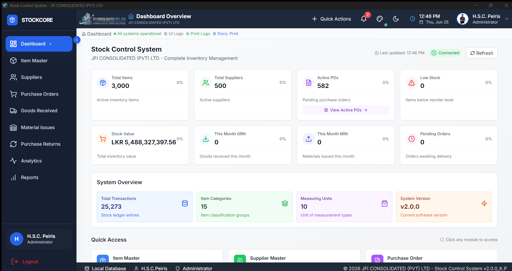
---
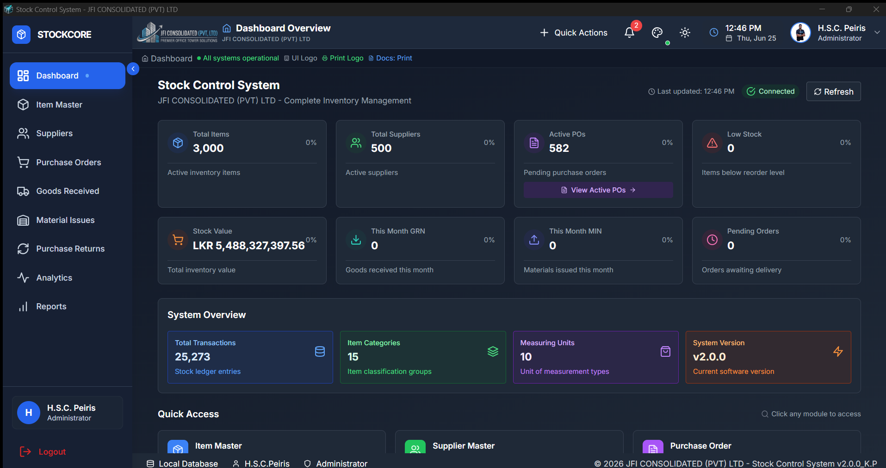
---
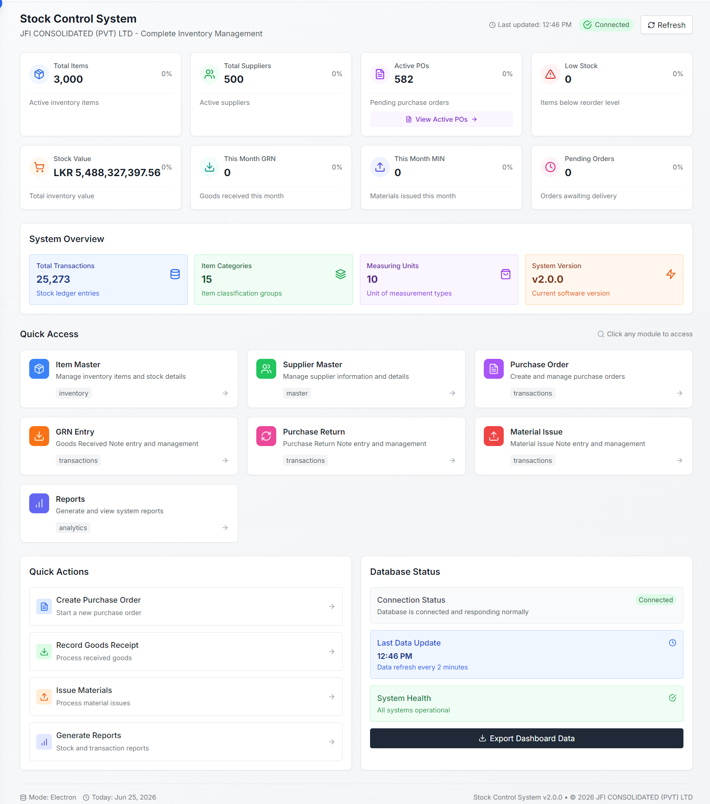
---
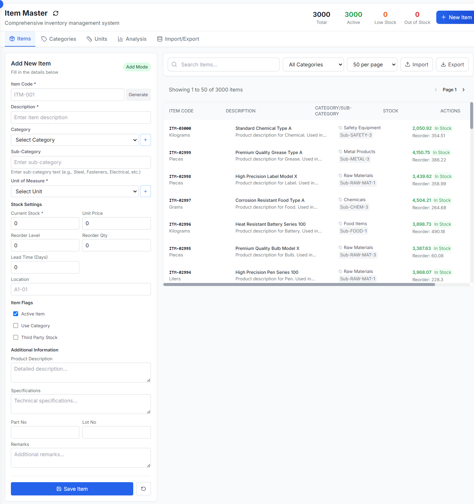
---
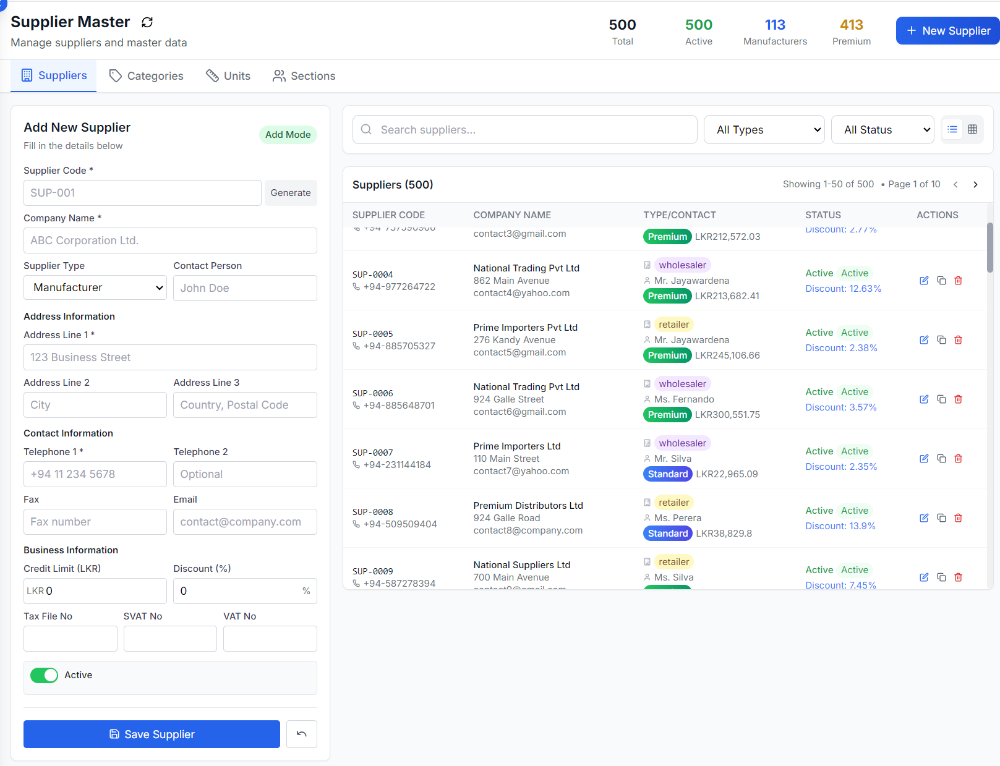
---
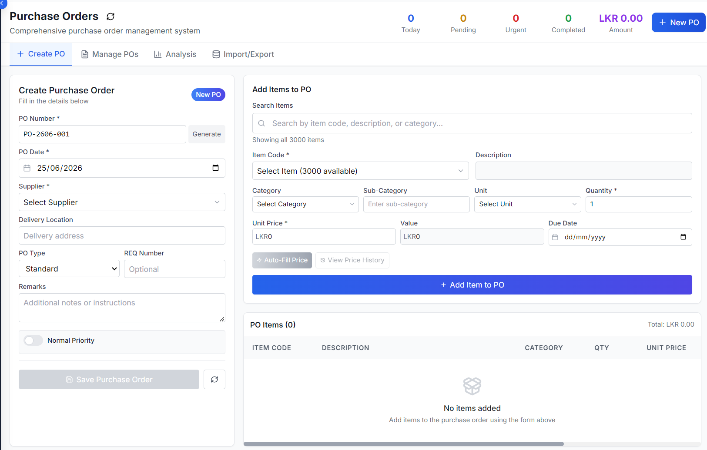
---
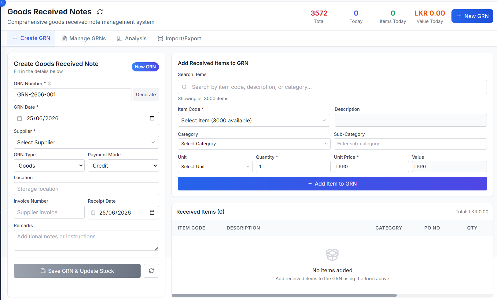
---
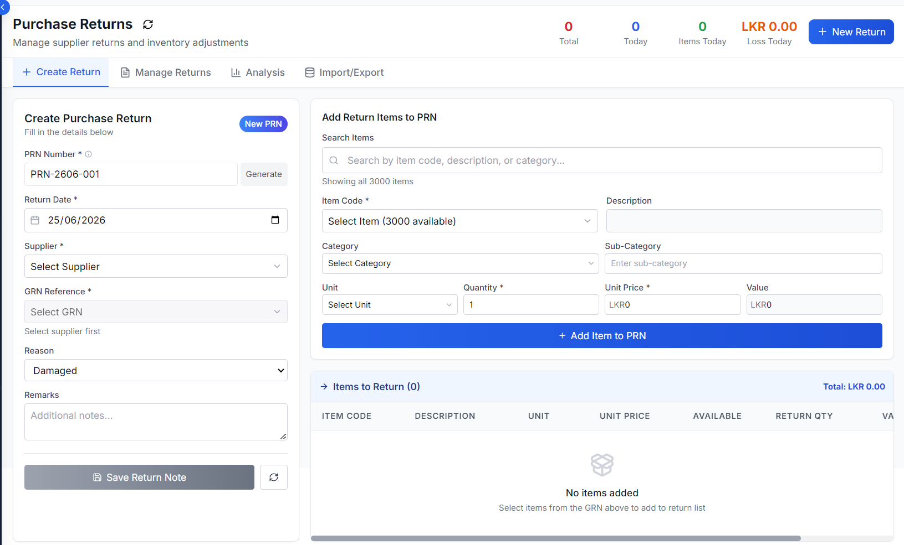
---
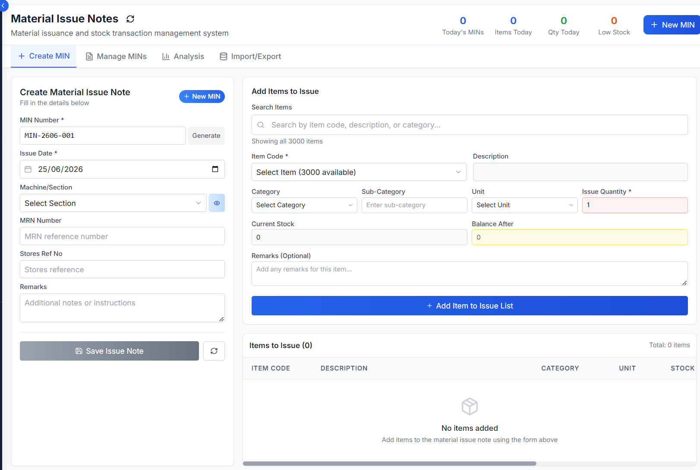
---
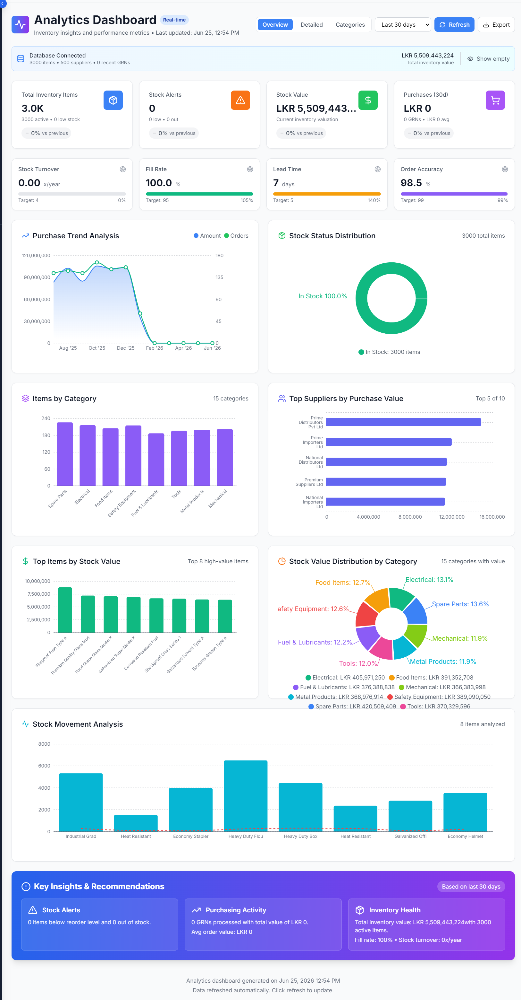
---
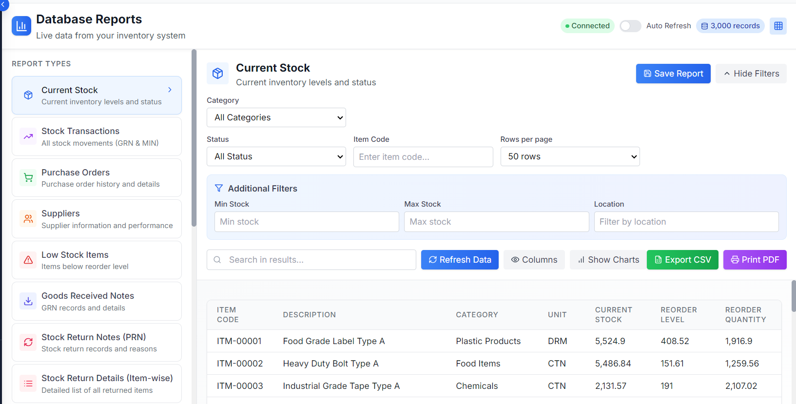
---
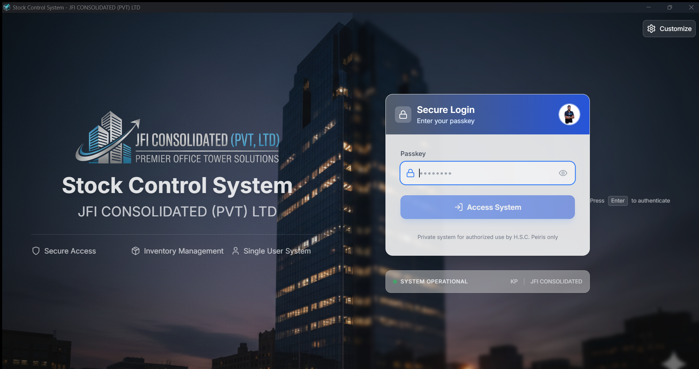
---
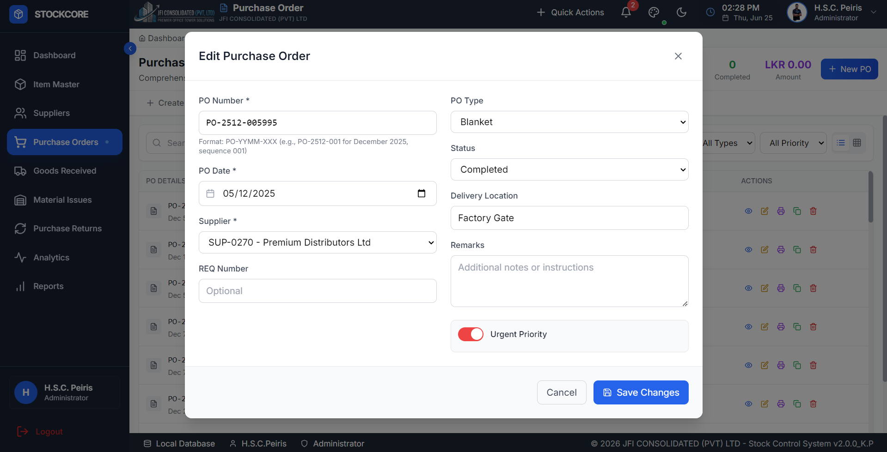
---
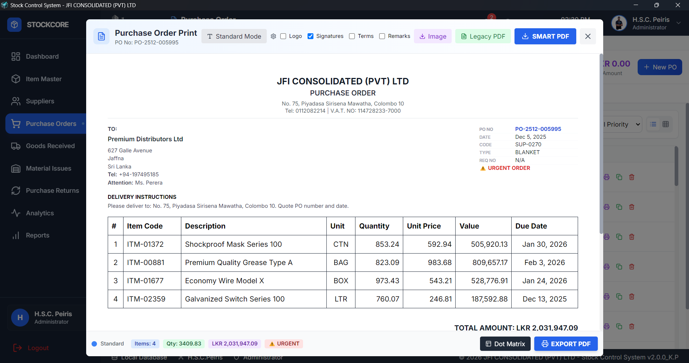
---
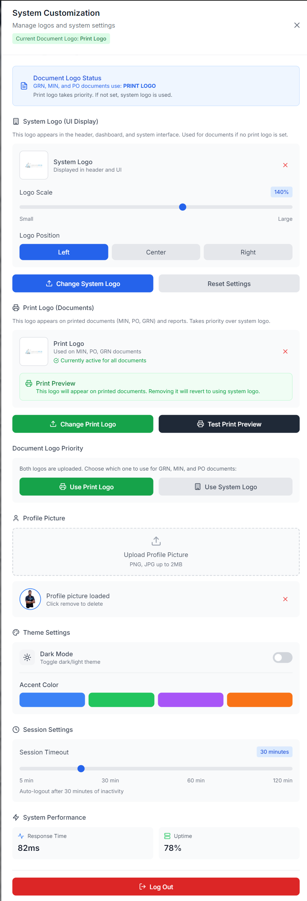
---


## 🚀 Running the Application

### Prerequisites
Make sure you have [Node.js](https://nodejs.org/) installed on your machine.

### Installation
1. Clone or copy the project files to your local environment.
2. In the project root, install required packages:
   ```bash
   npm install
   ```
3. Rebuild native SQLite3 bindings for Electron's runtime:
   ```bash
   npm run rebuild
   ```

### Development Mode
To run the React renderer concurrently with the Electron container shell:
```bash
npm run dev
```

### Packaging & Distribution
To package the app into a production-ready Windows executable installer:
```bash
# General build and distribution packaging
npm run dist

# Build only the portable standalone version
npm run dist:portable

# Complete clean rebuild and package pipeline
npm run full-build
```
The output installers will be compiled inside the `/dist` directory.
